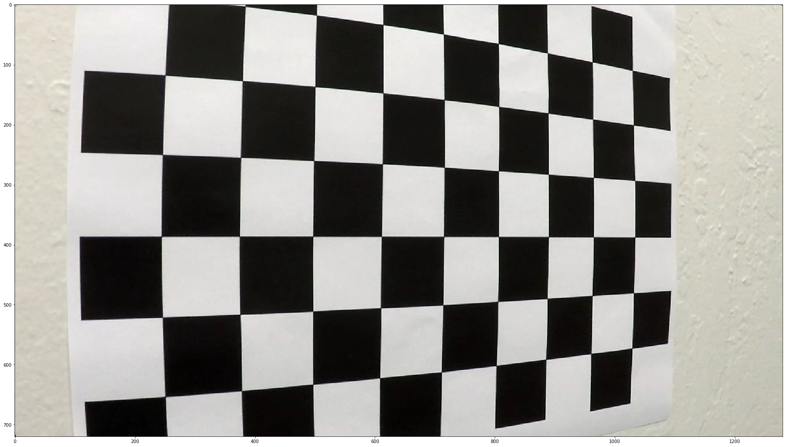
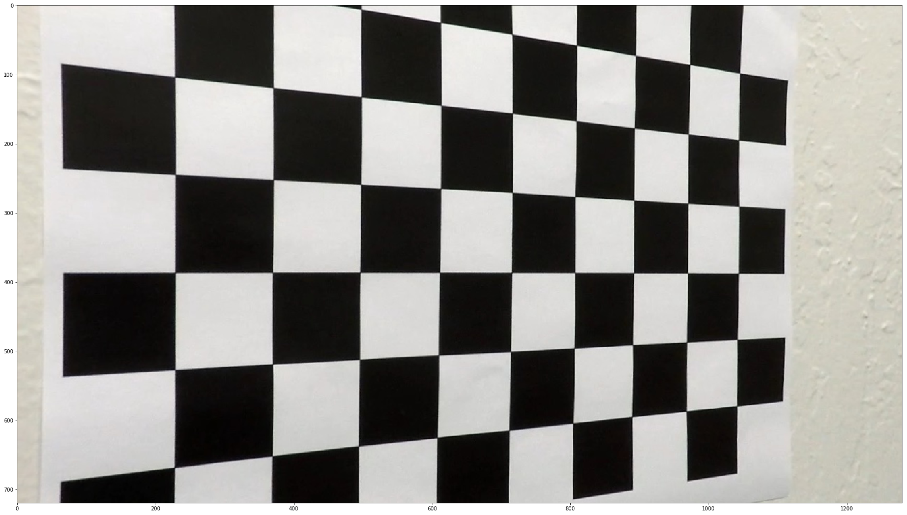
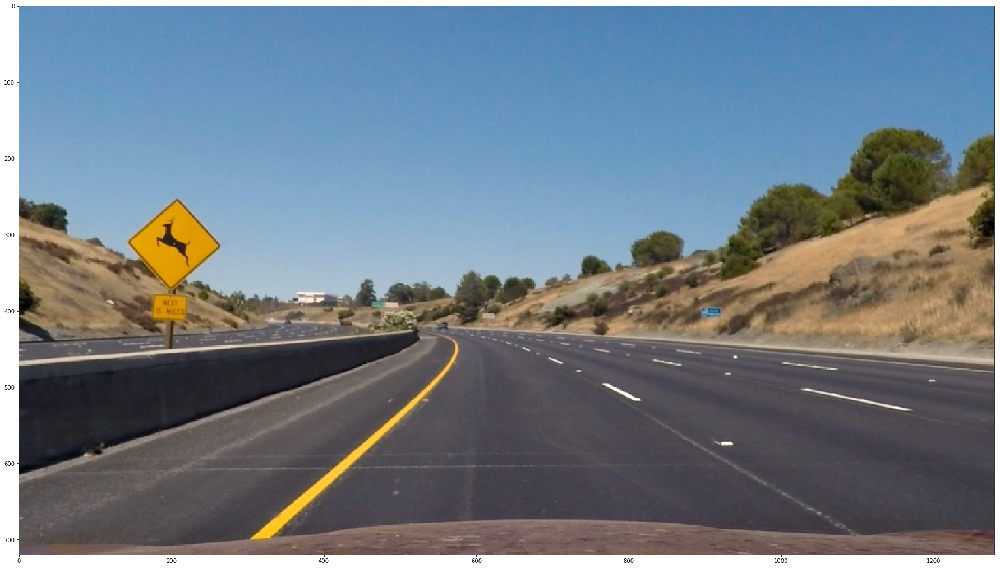
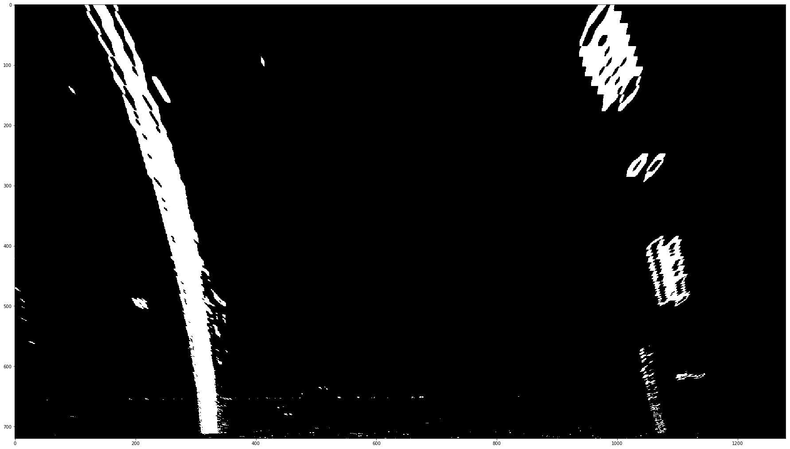
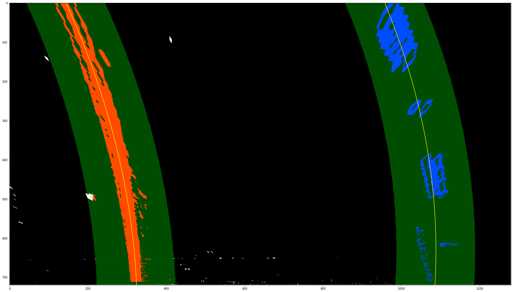
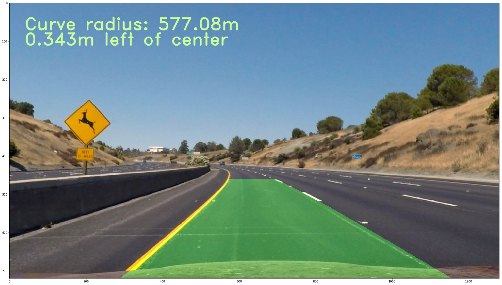

## Project Writeup

---

**Advanced Lane Finding Project**

The goals / steps of this project are the following:

* Compute the camera calibration matrix and distortion coefficients given a set of chessboard images.
* Apply a distortion correction to raw images.
* Use color transforms, gradients, etc., to create a thresholded binary image.
* Apply a perspective transform to rectify binary image ("birds-eye view").
* Detect lane pixels and fit to find the lane boundary.
* Determine the curvature of the lane and vehicle position with respect to center.
* Warp the detected lane boundaries back onto the original image.
* Output visual display of the lane boundaries and numerical estimation of lane curvature and vehicle position.

## [Rubric](https://review.udacity.com/#!/rubrics/571/view) Points

### Here I will consider the rubric points individually and describe how I addressed each point in my implementation.  

---

### Writeup / README

### Camera Calibration

#### 1. Briefly state how you computed the camera matrix and distortion coefficients. Provide an example of a distortion corrected calibration image.

The calibration code is present in `helper_functions.py` file. Name of the function is `calibrate()`.

I start by preparing "object points", which will be the (x, y, z) coordinates of the chessboard corners in the world. Here I am assuming the chessboard is fixed on the (x, y) plane at z=0, such that the object points are the same for each calibration image.  Thus, `objp` is just a replicated array of coordinates, and `objpoints` will be appended with a copy of it every time I successfully detect all chessboard corners in a test image.  `imgpoints` will be appended with the (x, y) pixel position of each of the corners in the image plane with each successful chessboard detection.  

I then used the output `objpoints` and `imgpoints` to compute the camera calibration and distortion coefficients using the `cv2.calibrateCamera()` function.  I applied this distortion correction to the test image using the `cv2.undistort()` function and obtained this result: 

Original image    

After calibration image   

As we can see after applying undistort() function chess board lines are straight.

### Pipeline

#### 1. Provide an example of a distortion-corrected image.

To demonstrate this step, I will describe how I apply the distortion correction to one of the test images like this one:

#### 2. Describe how (and identify where in your code) you used color transforms, gradients or other methods to create a thresholded binary image.  Provide an example of a binary image result.

I used a combination of color and gradient thresholds to generate a binary image (thresholding steps are in `transform` in `helper_functions.py`).  Here's an example of my output for this step.  

#### 3. Describe how (and identify where in your code) you performed a perspective transform and provide an example of a transformed image.

The code for my perspective transform includes a function called `warp()`, in the file `helper_functions.py`.  The `warp()` function takes as inputs an image (`img`), `nx`, `ny`, `mtx` and `dist`.

I used the following hardcoded source and destination points:

| Source        | Destination   | 
|:-------------:|:-------------:| 
| 580, 460      | 200, 0        | 
| 710, 460      | 520, 0      	|
| 1150, 720     | 520, 1280     |
| 150, 720      | 200, 1280     |

Image after applying perpective transformation.

#### 4. Describe how (and identify where in your code) you identified lane-line pixels and fit their positions with a polynomial?

Then I calculated the center of left and right lane lines using peak point of intensity histograms. Using these peak point as starting point, I mapped bounding boxes around high intensity pixels. This gave me the indexes where lane lines are present. After that I fitted 2nd degree polynomial to the data points.

Image after fitting polynomial.  

#### 5. Describe how (and identify where in your code) you calculated the radius of curvature of the lane and the position of the vehicle with respect to center.

I calculated the radius of curvature in `calculate_radius()` function in `helper_functions.py`.

#### 6. Provide an example image of your result plotted back down onto the road such that the lane area is identified clearly.

I implemented this step in `helper_functions.py` in the function `draw_lines()`.  Here is an example of my result on a test image:

---

### Pipeline (video)

#### 1. Provide a link to your final video output.  Your pipeline should perform reasonably well on the entire project video.

Here's a [link to my video result](./output_project_video.mp4)

---

### Discussion

#### 1. Briefly discuss any problems / issues you faced in your implementation of this project.  Where will your pipeline likely fail?  What could you do to make it more robust?

For this project I used following steps in the pipeline

* Undistortion
* Transformation using color/gradient thresholding
* Perspective transformation using src/dst data points
* Curvature radius calculation
* Mapping lane lines back to original image

All the steps worked very well in mapping lane lines. I faced some problem in coming up with data points for src/dest for perspective transformation. But after few trial and error I was able to get good points. 

Output image becomes bit wobbly when the road color/texture changes. But it is within limit and recovers pretty soon. For further improvement I would use algorithm to calculate lane marking indices using moving average. This should help the pipeline in dealing with change in road texture/color.
